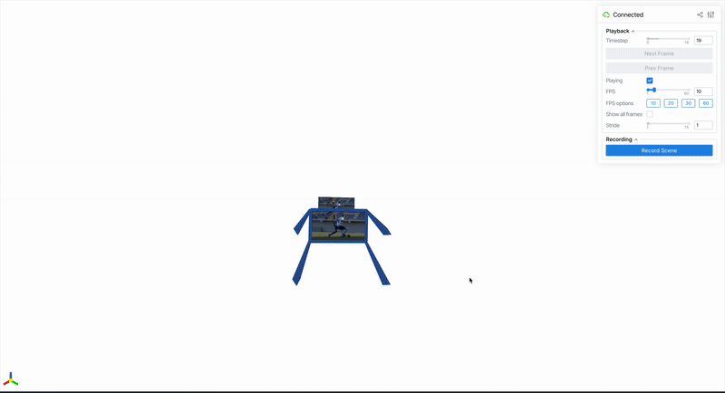

## About this repository

This is a modified version of the original [MegaSaM repository](https://github.com/mega-sam/mega-sam). The goal is to let you run MegaSaM on your own videos (from the wild) as easily as possible. In addition, I have made use of [SpatialVid](https://github.com/NJU-3DV/SpatialVID)'s visualisation code to make it easier to visualize the results which is based on another great project [viser](https://viser.studio/main/) - so big thanks to the authors of those two projects. 



## About MegaSaM

<!-- # 🚧 This repository is still not done and being uploaded, please stand by. 🚧  -->

[Project Page](https://mega-sam.github.io/index.html) | [Paper](https://arxiv.org/abs/2412.04463)

This code accompanies the paper

**MegaSam: Accurate, Fast and Robust Casual Structure and Motion from Casual
Dynamic Videos** \
Zhengqi Li, Richard Tucker, Forrester Cole, Qianqian Wang, Linyi Jin, Vickie Ye,
Angjoo Kanazawa, Aleksander Holynski, Noah Snavely

*This is not an officially supported Google product.*

## Clone

Make sure to clone the repository with the submodules by using:
`git clone --recursive git@github.com:mega-sam/mega-sam.git`

## Instructions for installing dependencies

### Python Environment

The following codebase was successfully run with Python 3.10, CUDA11.8, and
Pytorch2.0.1. We suggest installing the library in a virtual environment such as
Anaconda.

1.  To install main libraries, run:

    ```bash
    conda env create -f environment.yml
    ```

2.  To install xformers for UniDepth model, follow the instructions from
    https://github.com/facebookresearch/xformers. If you encounter any
    installation issue, we suggest installing it from a prebuilt file. For
    example, for Python 3.10+Cuda11.8+Pytorch2.0.1, run:

    ```bash
    conda install https://anaconda.org/xformers/xformers/0.0.22.post7/download/linux-64/xformers-0.0.22.post7-py310_cu11.8.0_pyt2.0.1.tar.bz2
    ```

3.  Compile the extensions for the camera tracking module from source:

    ```bash
    cd base; python setup.py install;cd ..
    ```
    Note that you need to have properly set `CUDA_HOME` environment variable
    pointing to your CUDA installation. When you are on cluster, it is often possible to load it as module, e.g. `module load cuda/11.8`. Alternatively, in the above conda env installation step, you have installed CUDA toolkit in the conda env, so you can set 

    ```bash
    export CUDA_HOME=$(dirname $(dirname $(which nvcc)))
    ``` 
    before running the above compilation command. I have only verified the cluster method.
    

### Downloading pretrained checkpoints

1.  Download [DepthAnything checkpoint](https://huggingface.co/spaces/LiheYoung/Depth-Anything/blob/main/checkpoints/depth_anything_vitl14.pth) your predefinned dir, here is my how I downloaded into my scratch dir where I store all pretrained models:

    ```bash
    wget https://huggingface.co/spaces/LiheYoung/Depth-Anything/resolve/main/checkpoints/depth_anything_vitl14.pth \
        -O /scratch/izar/cizinsky/pretrained/depth_anything_vitl14.pth
    ```

2.  Download and include [RAFT checkpoint](https://drive.google.com/drive/folders/1sWDsfuZ3Up38EUQt7-JDTT1HcGHuJgvT). This one is tricky because the link is to gdrive folder. Here is how I have donwloaded again into my scratch folder where I store all pretrained models:

    ```bash
    python -m pip install -U gdown typing_extensions bs4
    python -m gdown --folder https://drive.google.com/drive/folders/1sWDsfuZ3Up38EUQt7-JDTT1HcGHuJgvT \
    -O /scratch/izar/cizinsky/pretrained
    ``` 
    Note that I first install `gdown` package to be able to download from gdrive. You can also download the file manually if you prefer but that's too much work.

## Running MegaSaM your own video (in form of folder with frames)

Now, with the installation out of the way, you can run MegaSaM on your own video. Please, first go over the first section of the [run_megasam.sh](run_megasam.sh) script and edit the paths to your liking. I mark clearly what needs to be set and what you can leave as is. Then run:

```bash
bash run_megasam.sh 
```

This will run the full pipeline and save the results to the `OUT_DIR` you specified in the script. 
Apart from the intermediate results saved in folders (depth_anything, unidepth, raft_flow, reconstructions), there will be the final output saved as `sgd_cvd_hr.npz` saved at the root of the `OUT_DIR`. You can then visualise the result by running (and pointing to the correct data file):

```bash
python viser/visualize_megasam.py \
  --data /scratch/izar/cizinsky/multiply-output/preprocessing/data/football_high_res/megasam/sgd_cvd_hr.npz
```

If you are on VSCode, you can add port forwarding to your ssh session and then open the visualisation in your browser at `localhost:8080` or whatever port you specified.

## Contact

For any questions related to our paper, please send email to zl548@cornell.edu.


## Bibtex

```
@inproceedings{li2024_megasam,
  title     = {MegaSaM: Accurate, Fast and Robust Structure and Motion from Casual Dynamic Videos},
  author    = {Li, Zhengqi and Tucker, Richard and Cole, Forrester and Wang, Qianqian and Jin, Linyi and Ye, Vickie and Kanazawa, Angjoo and Holynski, Aleksander and Snavely, Noah},
  booktitle = {arxiv},
  year      = {2024}
}
```

## Copyright

Copyright 2025 Google LLC  

All software is licensed under the Apache License, Version 2.0 (Apache 2.0); you may not use this file except in compliance with the Apache 2.0 license. You may obtain a copy of the Apache 2.0 license at: https://www.apache.org/licenses/LICENSE-2.0

All other materials are licensed under the Creative Commons Attribution 4.0 International License (CC-BY). You may obtain a copy of the CC-BY license at: https://creativecommons.org/licenses/by/4.0/legalcode

Unless required by applicable law or agreed to in writing, all software and materials distributed here under the Apache 2.0 or CC-BY licenses are distributed on an "AS IS" BASIS, WITHOUT WARRANTIES OR CONDITIONS OF ANY KIND, either express or implied. See the licenses for the specific language governing permissions and limitations under those licenses.

This is not an official Google product.

